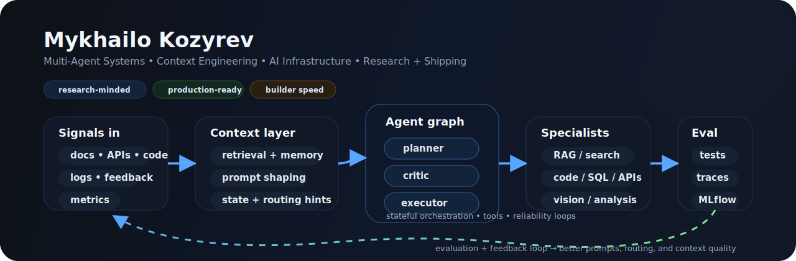

<p align="center">
  
</p>

<p align="center">
  <a href="https://linkedin.com/in/mykhailo-kozyrev"></a>
  <a href="https://devpost.com/smrtkozyrev"></a>
  <a href="https://the-pum.com"></a>
  <a href="mailto:mykhailo.kozyrev@tum.de"></a>
  <a href="https://github.com/Smikalo?tab=followers"></a>
  <a href="https://github.com/Smikalo?tab=repositories&sort=stargazers"></a>
</p>

---

I build and study **AI agents** and **multi-agent systems** — from production AI pipelines for Fortune 500 companies to research on how to optimize agents use context, memory, and orchestration.

- 🔬 **Applied Research Intern @ JetBrains Research** — studying context engineering for AI coding agents (Claude Code, Cursor, Copilot). Large-scale repo mining, embedding-based clustering, LLM-assisted pattern extraction.
- 🏗️ **Data & AI Software Engineer @ KI performance** — shipped multi-agent LLM systems for Microsoft, Lufthansa, Mercedes-Benz, DHL. LangGraph orchestration on Azure. Certified: Azure AI Engineer, Azure Developer, Databricks Developer.
- 📄 **Published** a systematic literature review on agentic systems optimization — five-layer taxonomy across 32 primary studies.
- 🚀 **Founded [PUM](https://the-pum.com)** — 50+ member builder collective, 15+ international hackathons, 10+ shipped prototypes under 24–48h constraints.
- 🎓 **B.Sc. Computer Science @ TUM** — 5th semester, 149 ECTS (125% of recommended pace).


## Research interests:
  1. Multi-agent system optimization — architecture, evaluation, performance
  2. Context & environment engineering for AI coding agents — configs, memory, orchestration
  3. Prompt analysis & refinement — pattern recognition, quality metrics, debugging

---

## 🏆 Hackathon Track Record

```

15+ international hackathons  ·  10+ shipped systems  ·  50+ team members

```

Built systems across:
- multi-agent RAG platforms  
- real-time data + ML pipelines  
- accessibility & navigation  
- developer productivity tools  

👉 Full portfolio: https://devpost.com/smrtkozyrev

## 🏆 Hackathons & community

```
15+ international hackathons  ·  10+ shipped prototypes  ·  50+ builders in PUM
```

Projects span multi-agent RAG platforms, real-time big-data pipelines, accessibility-first navigation, gamified developer tools, and prediction markets.

<a href="https://devpost.com/smrtkozyrev"></a>

---

## 🛠️ Tools I use

### 👨‍💻 Languages

<p>
  <a href="https://github.com/search?q=user%3ASmikalo+language%3Apython"></a>
  <a href="https://github.com/search?q=user%3ASmikalo+language%3Atypescript"></a>
  <a href="https://github.com/search?q=user%3ASmikalo+language%3Ajavascript"></a>
  <a href="https://github.com/search?q=user%3ASmikalo+language%3Ac"></a>
  <a href="https://github.com/search?q=user%3ASmikalo+language%3Acpp"></a>
  <a href="https://github.com/search?q=user%3ASmikalo+language%3Ajava"></a>
  <a href="https://github.com/search?q=user%3ASmikalo+language%3Asql"></a>
  <a href="https://github.com/search?q=user%3ASmikalo+language%3Ar"></a>
  <a href="https://github.com/search?q=user%3ASmikalo+language%3Aphp"></a>
  <a href="https://github.com/search?q=user%3ASmikalo+language%3Aswift"></a>
</p>

### 🤖 AI / ML

<p>
  
  
  
  
  
  
  
  
  
</p>

### 🧰 Frameworks & infrastructure

<p>
  
  
  
  
  
  
  
  
  
  
  
</p>

### 🗄️ Data & cloud

<p>
  
  
  
  
  
  
  
</p>

---

## 📊 Activity

<p align="center">
  
</p>

<div align="center">
  <a href="https://github.com/DenverCoder1/github-readme-streak-stats"></a>
  
</div>

---


## Beyond code

I enjoy high-intensity environments where good systems thinking matters — especially hackathons, research-driven prototyping, and interdisciplinary research-heavy builds that need to go from idea to demo fast.

---

<p align="center">
  <strong>Let’s connect!</strong><br/>
  <a href="https://www.linkedin.com/in/mykhailo-kozyrev/">LinkedIn</a> · <a href="https://devpost.com/smrtkozyrev">Devpost</a> · <a href="https://the-pum.com/">PUM</a> · <a href="mailto:mykhailo.kozyrev@tum.de">Email</a>
</p>


## Writing & research

### Agentic Systems Optimization — TUM seminar paper
A systematic literature review of **32 primary studies** on optimizing LLM-based agentic systems.

**Core output:** a five-layer taxonomy covering:
1. reasoning strategies  
2. tools & memory  
3. multi-agent orchestration  
4. hardware / systems efficiency  
5. governance / control

**Why this matters:** I care about agent systems not just as demos, but as systems that can be compared, evaluated, and improved rigorously.

### Current research direction
**Context engineering for AI coding agents**

I am especially interested in:
- configuration patterns for agent behavior
- memory systems and context window strategy
- prompt structure quality and failure analysis
- orchestration patterns that improve developer productivity

> I like work that turns vague “agent magic” into something inspectable, testable, and architecturally sound.

---

## Experience highlights

### KI performance — Data & AI Software Engineer
- Built multi-agent LLM systems with orchestration, tool execution, and automated evaluation
- Worked with Azure, Databricks, MLflow, and CI/CD around production AI workflows
- Contributed to client work involving organizations such as Microsoft, Lufthansa, Mercedes-Benz, and DHL

### JetBrains Research — incoming Applied Research Intern
- Researching best practices in context engineering for multi-agent systems
- Interested in how coding agents use configs and context management in the wild
- Exploring repository mining, clustering, and pattern extraction approaches

### PUM — Project of United Minds
- Built and led a fast-moving builder collective around hackathons, prototypes, and research demos
- Comfortable leading engineering in 24–48h build cycles
- Bias toward turning systems ideas into working products quickly


### A bit more context

* At **KI performance**, I work on multi-agent LLM systems, prompt iteration, automated evaluation of non-deterministic outputs, and Azure/Databricks-based data pipelines.
* In my latest CV, I also describe an **incoming/applied research track with JetBrains Research** around best practices in context engineering for multi-agent coding systems.
* I authored a **systematic literature review on agentic systems optimization**, building a five-layer taxonomy across 32 primary studies.
* Through **PUM** and hackathons, I have led teams shipping fast prototypes across AI, healthcare, developer tools, accessibility, mobility, and data-heavy systems.

---


---

## ⚙️ What I Care About

- Making **AI systems reliable, testable, and measurable**
- Turning research into **real production systems**
- Designing **clean system architectures for agents**
- Building fast under constraints (**hackathons → real products**)

---

<p align="center">
  🌐 <b>Languages:</b> English (C2) · German (C1) · Ukrainian (Native) · Russian (Native)
  <br/>
  📍 Munich, Germany · 5th semester B.Sc. CS @ TUM · 149 ECTS (125% pace)
</p>

<h1 align="center">Hey, guys! Michael here 
<div align="center">
